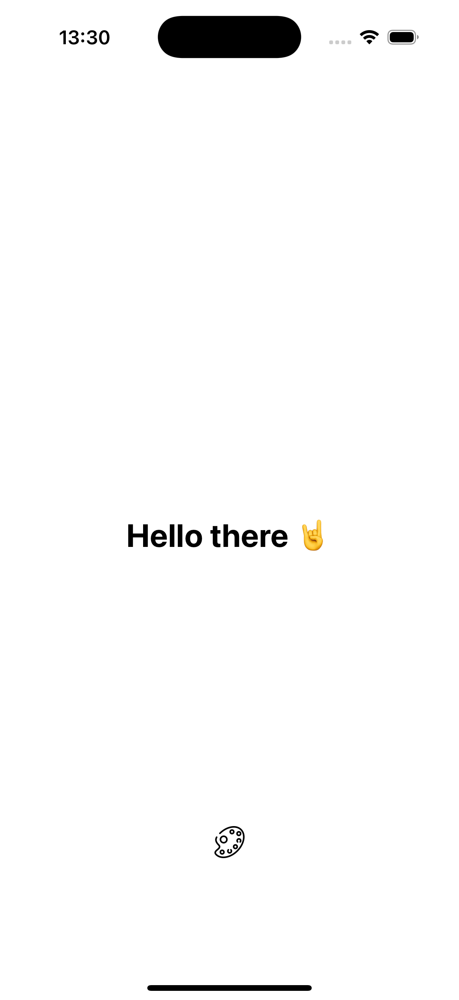
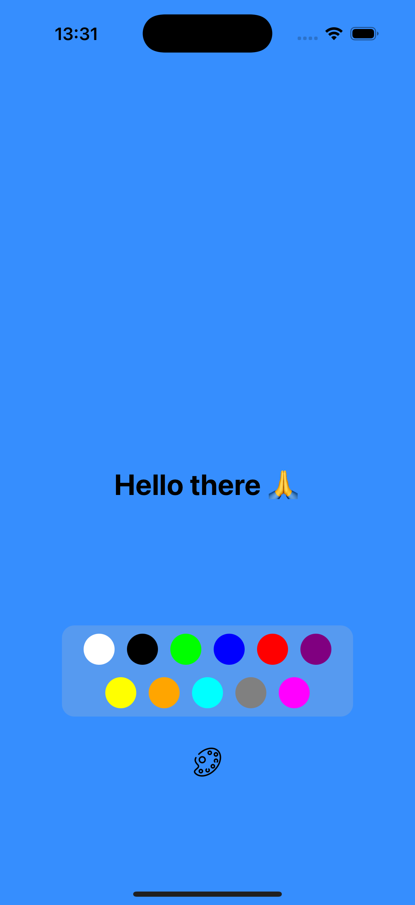
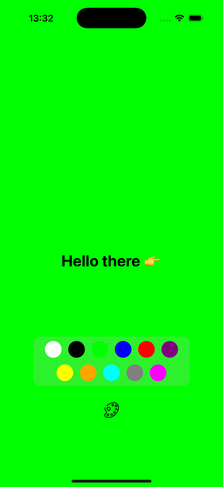
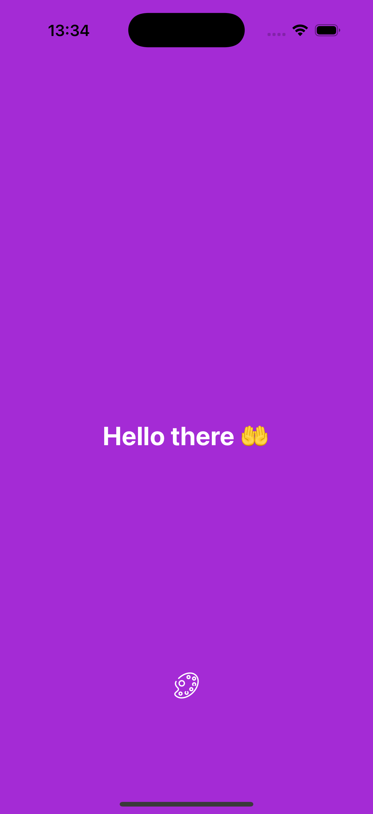

# 📱 Random Color App

Welcome to Random Color App repository.
This app's function is to change the background color every time the screen is touched. A feature was also added to display a random emoji. Additionally, it is possible to set a specific background color for the app.

|                               |                               |                               |                               |
| :---------------------------: | :---------------------------: | :---------------------------: | :---------------------------: |
|  |  |  |  |

## ⛏️ Tech (Libs and Techs)

- [React Native (Expo)](https://reactnative.dev/)
- [TypeScript](https://www.typescriptlang.org/)

## 🚀 Project Execution

📋 Before you begin, make sure you have the following tools installed:

```
npm or Yarn
```

- Clone the repository

```
git clone git@github.com:davidrappa/random-color-app.git
cd random-color-app
```

- Install dependencies:

```
npm install 
// or 
yarn install // recommended
```

- Start the project

```
npm run start 
// or
yarn start
```

Use your smartphone with Expo Go or the emulator on PC and follow the terminal for open in iOS or Android.

## 👨🏻‍💻 Who I am ?

**David Rappa** is a React Native specialist with **over 5 years of experience** in developing high-performance applications for companies in Brazil. He currently works as a **software engineer**, applying the techniques and concepts he has learned on a daily basis.

- [LinkedIn](https://www.linkedin.com/in/davidrappa1/)
- [GitHub](https://github.com/davidrappa)
- [Instagram](https://www.instagram.com/dvdrpp/)